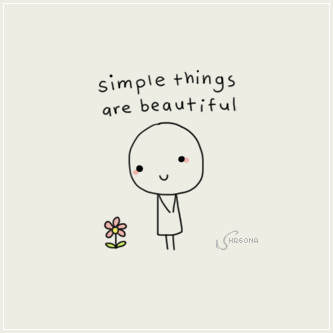

<div align="center">
<h1>components</h1>

  

<br />

</div>

<h1>React components | <a target="_blank" href="https://kk-compponents.vercel.app/">storybook</a></h1>

<br />

To get it started, add `components` to your project:

```sh
yarn add @kkatkus/components
```

Or if you prefer using npm:

```sh
npm install @kkatkus/components --save
```

<br />
<h1>Theme</h1>

Palette colors are represented by four tokens:

main: The main shade of the color
light: A lighter shade of main
dark: A darker shade of main
contrastText: Text color, intended to contrast with main


Default colors

The theme exposes the following default palette colors (accessible under theme.palette.*):

primary - for primary interface elements.
secondary - for secondary interface elements.
error - for elements that the user should be made aware of.
warning - for potentially dangerous actions or important messages.
info - for highlighting neutral information.
success - for indicating the successful completion of an action that the user triggered.


<h1>Components</h1>

```jsx
<Input />
```